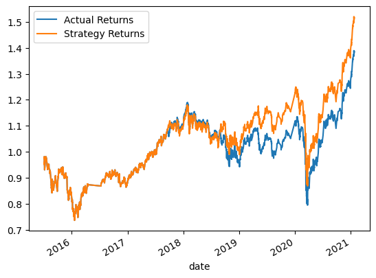
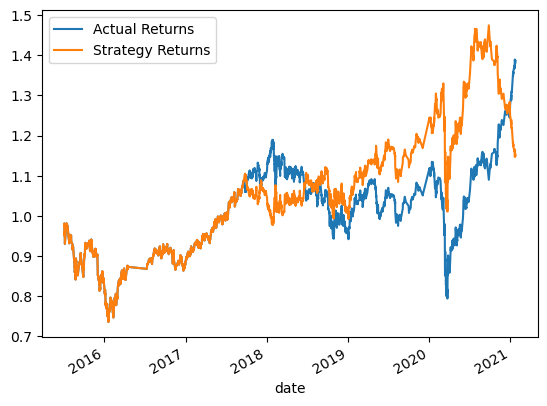
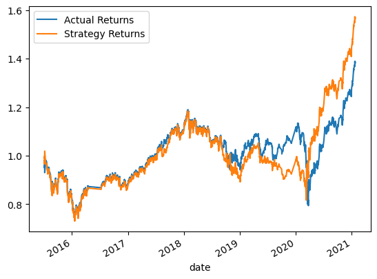
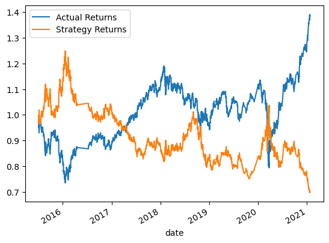

# ML-Algo-Trading


## **Machine Learning Trading Bot**

Code is in machine_learning_trading_bot.ipynb notebook.  Required csv file is in the Resources folder.

#### **SVM Baseline Model Summary:** ####

```markdown
              precision    recall  f1-score   support

        -1.0       0.43      0.04      0.07      1804
         1.0       0.56      0.96      0.71      2288

    accuracy                           0.55      4092

   macro avg       0.49      0.50      0.39      4092

weighted avg       0.50      0.55      0.43      4092
```

* The SVM baseline model shows ok accuracy at 55%, good recall (96%) on long positions, poor recall on short positions (4%)
* Precision is not as robust as recall in this model given lower precision scores on both the long and short sides vs. recall scores.
* SVM model as is seems a good model to use for long entries, not a good model for short entries.

#### **SVM Model Returns Plot** ####



* Overall, the algo strategy returns seem to beat actual returns and looks like a feasible strategy.  
* The primary reason for the beat is more bullish positions means more long positions vs. short positions during this timeframe, this model performs better on bullish positions.

#### **Logistic Regression Model Summary:** ####

```markdown
              precision    recall  f1-score   support

        -1.0       0.44      0.33      0.38      1804
         1.0       0.56      0.66      0.61      2288

    accuracy                           0.52      4092
   macro avg       0.50      0.50      0.49      4092
weighted avg       0.51      0.52      0.51      4092
```
* The Logistic Regression model shows lower accuracy at 52% vs. the SVM model at 55%. 
* Model recall is lower for long positions at 66% but higher for short positions at 33% (still not a great value)
* Precision is not as robust as recall on the long side but is better on the short side.  Neither precision score here is better than the SVM model. 
* The logistic model is not as good a trading algo model as the SVM model.  I would drop it.

#### **Logistic Regression Model Returns Plot** ####



* Overall, the algo strategy was doing very well in performance vs actual results until a strange turn near the final year when the strategy performed poorly vs. actual returns.
* This model is out given the poor recent market performance.

#### **ADA Boost Model Summary:** ####

```markdown
              precision    recall  f1-score   support

        -1.0       0.44      0.08      0.13      1804
         1.0       0.56      0.92      0.70      2288

    accuracy                           0.55      4092
   macro avg       0.50      0.50      0.41      4092
weighted avg       0.51      0.55      0.45      4092
```
* This model is almost identical in performance to the SVM model.  Accuracy score is the same at 55%
* Recall scores are slightly worse on longs (92 v 96) and slightly better on shorts (8 v 4) vs. the SVM model
* Precision scores are identical vs SVM model
* Bottom line, a similar model to SVM, no material added value so I'd stick with the SVM model.

#### **ADA Boost Model Returns Plot** ####



* Overall, the algo strategy returns seem to beat actual returns and looks like a feasible strategy (similar to SVM model) 
* No material added value vs. baseline so I would stick with the baseline model.

#### **Decision Tree Model Summary:** ####

```markdown
              precision    recall  f1-score   support

        -1.0       0.44      0.84      0.58      1804
         1.0       0.54      0.15      0.23      2288

    accuracy                           0.45      4092
   macro avg       0.49      0.49      0.40      4092
weighted avg       0.50      0.45      0.38      4092
```

* The Decision Tree model is the lowest performing model overall with a 45% accuracy score.
* The long side (1.0) performs poorly vs. all other models but the short side performs better than all other models (higher recall scores for -1.0 vs. all other models)
* Precision score is around the same for longs and shorts.
* I would not use this model for long trading strategies, it may be worth a look for short strategies vs. using the SVM algo for short positions. 

#### **Decision Tree Model Returns Plot** ####



* Overall, not a good algo to use vs. other options; however, worth a look for short position strategies moving forward.